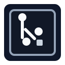
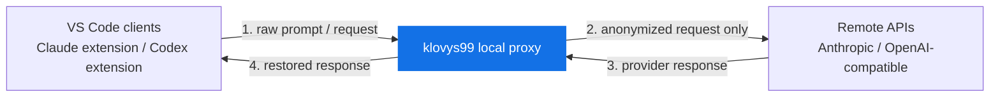
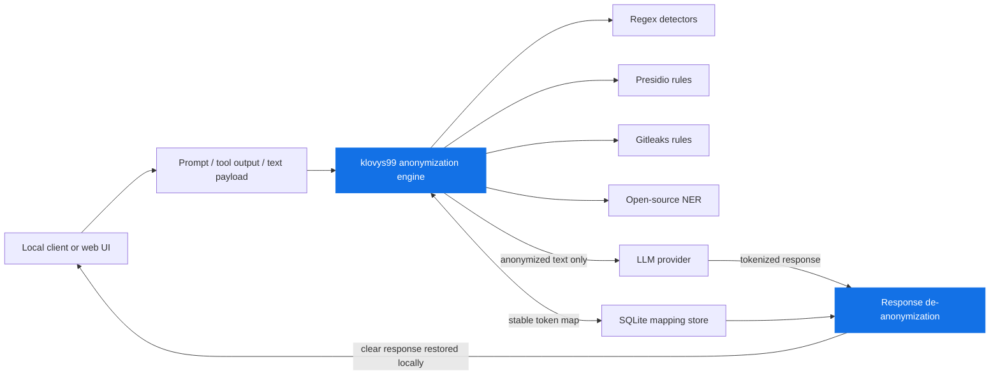
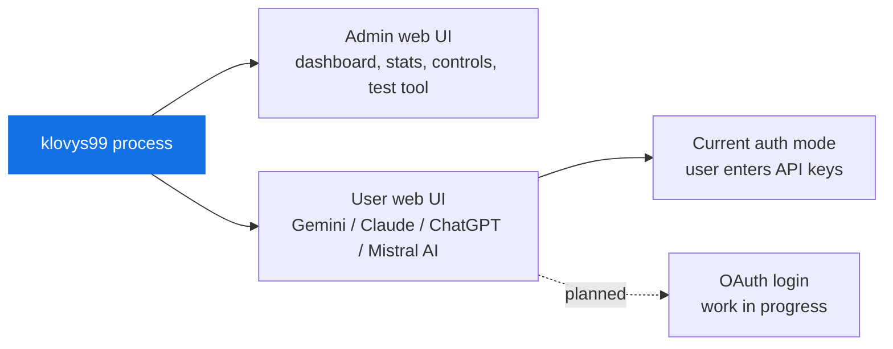

# klovys99

[](LICENSE)

- Compatible with
  
  Claude Code,
  
  Codex, and other
  
  OpenAI-compatible clients.
- Anonymizes sensitive values before they leave the machine, sends only tokenized
  payloads upstream, then restores the original values locally in responses.
- Includes a local dashboard and test tool, powered by
  
  Presidio,
  
  Gitleaks, a local NER engine, and
  
  SQLite for stable anonymization and de-anonymization round-trips.

## Architecture At A Glance







## Get Started

> **npm install is currently broken.** Until it is fixed, run klovys99 from
> source: start the app manually with Go and start the GLiNER sidecar with
> Docker, as described below.

For Claude OAuth in the AI workspace, the standard runtime is now Docker
Compose so the Go app and Claude CLI run in the same containerized environment.

1. Copy the environment template and set a real
   `KLOVYS99_AI_WORKSPACE_KEY`.

```sh
cp .env.example .env
```

`compose.yaml` charge ensuite explicitement ce fichier `.env` pour les
services `gliner` et `klovys99`.

2. Start the full stack, including the Go proxy, GLiNER, and Claude CLI.

```sh
docker compose up --build
```

This exposes klovys99 on `http://127.0.0.1:8080`, persists the AI workspace
state under `./.data/ai-workspace`, and keeps Claude CLI state under
`./.data/claude-home`. Claude OAuth no longer requires a local `claude`
installation in this mode. The root compose stack shares the GLiNER network
namespace with `klovys99`, so `KLOVIS_GLINER_URL` stays on
`http://127.0.0.1:8091` to satisfy the backend loopback-only check.

If you prefer the previous source-driven development flow, the simplest way to
start everything (GLiNER sidecar + proxy) in one command remains:

```sh
./scripts/dev-start.sh
```

This creates `.env` from `.env.example` if needed, builds the GLiNER Docker
image, downloads the pinned model on first run, and then launches the root
`docker compose up --build` stack.

If you prefer to run the steps yourself from the repository root:

1. Build and start the GLiNER sidecar with Docker.

```sh
docker build -t klovys99-gliner:local sidecar/gliner
docker run --rm --user "$(id -u):$(id -g)" \
  -e GLINER_MODEL=urchade/gliner_multi_pii-v1 \
  -e GLINER_MODEL_REVISION=1fcf13e85f4eef5394e1fcd406cf2ca9ea82351d \
  -e GLINER_MODEL_DIR=/models/model \
  -e HOME=/tmp -e XDG_CACHE_HOME=/tmp/.cache -e HF_HOME=/tmp/.cache/huggingface \
  -v "$HOME/.klovys99/gliner:/models" \
  klovys99-gliner:local python /app/install_model.py
KLOVIS_GLINER_MODEL=urchade/gliner_multi_pii-v1 \
KLOVIS_GLINER_MODEL_REVISION=1fcf13e85f4eef5394e1fcd406cf2ca9ea82351d \
KLOVIS_GLINER_DATA_DIR="$HOME/.klovys99/gliner" \
  docker compose -f sidecar/gliner/compose.yaml up -d --no-build
```

2. Start the local proxy with Go, pointing it at the sidecar you just started.

```sh
KLOVIS_GLINER_MODE=full \
KLOVIS_GLINER_URL=http://127.0.0.1:8091 \
KLOVIS_GLINER_MODEL=urchade/gliner_multi_pii-v1 \
KLOVIS_GLINER_MODEL_REVISION=1fcf13e85f4eef5394e1fcd406cf2ca9ea82351d \
  go run ./cmd/klovys99
```

Klovys99 listens on `http://127.0.0.1:8080` by default and exposes:

- `http://127.0.0.1:8080/anthropic` for Claude Code and other Anthropic clients
- `http://127.0.0.1:8080/openai/v1` for Codex and other OpenAI-compatible
  clients

The historical unprefixed route also still exists and forwards to
`KLOVIS_TARGET_URL`, which defaults to `https://api.anthropic.com`.

4. Optional: launch the AI workspace UI, a chat interface that anonymizes your
   prompt before sending it to a provider you configure with your own API key.
   If you want the `Compte IA` / `AI accounts` panel to persist provider API
   keys and Claude OAuth tokens across reloads and restarts, set
   `KLOVYS99_AI_WORKSPACE_KEY` first (you can generate one with
   `openssl rand -hex 32`).

```sh
npm run ui:ai-workspace
```

This starts a local Vite dev server at `http://127.0.0.1:3001` that proxies
`/api` and `/dashboard` requests to the running proxy on port 8080. The
dashboard header and the `AI workspace` link both point here. See
[AI Workspace](#ai-workspace) for details.

If you installed the published npm package instead of cloning this repository,
use the same flow with `npx klovys99`:

3. Point your client at the proxy manually — see
   [Client Configuration](#client-configuration) below, since the
   `configure` CLI helper is part of the currently broken npm flow.

## Features

- Local reverse proxy for Anthropic and OpenAI-compatible JSON requests.
- Built-in deterministic detectors for common PII and sensitive identifiers.
- Local GLiNER Docker sidecar with explicit `full` and `off` modes.
- Dynamic detector loading from the official Gitleaks and Microsoft Presidio
  rule sources.
- Stable pseudonym tokens for the lifetime of the proxy process.
- Structured logs with anonymization counters instead of raw prompt values.
- Disk cache for downloaded external rules to avoid repeated network fetches on
  every startup.
- A dashboard for live anonymization stats and a manual anonymization test
  tool.
- An AI workspace UI for chatting with Claude, Gemini, OpenAI, or Mistral
  using an anonymized prompt, without leaving the anonymization boundary.

## Requirements

- Go 1.25 or newer.
- Docker Desktop or Docker Engine, to run the GLiNER sidecar and the
  containerized Claude OAuth runtime.
- Network access on first startup to download the default Gitleaks and Presidio
  rule sources, and the pinned GLiNER model.
- An Anthropic API key, Claude subscription, or OpenAI API key depending on the
  client you route through Klovys99.

Check your local tooling:

```sh
go version
docker version
```

## Installation

npm installation is currently broken. Build and run from source instead:

```sh
git clone https://github.com/Korbicorp/klovys99.git
cd klovys99
go build -o klovys99 ./cmd/klovys99
```

See [Get Started](#get-started) for both the Docker Compose runtime and the
source-driven development flow.

## Client Configuration

The `configure` CLI helper is part of the currently broken npm flow. Point
your client at the proxy by editing its config file directly.

### Codex

Edit `~/.codex/config.toml` and set:

```toml
openai_base_url = "http://127.0.0.1:8080/openai/v1"
```

### Claude Code

Edit `~/.claude/settings.json` and set:

```json
{
  "env": {
    "ANTHROPIC_BASE_URL": "http://127.0.0.1:8080/anthropic"
  }
}
```

If klovys99 listens on another address, use that instead of
`127.0.0.1:8080` in either snippet.

## Quick API Checks

Anthropic-style request through Klovys99:

```sh
curl http://127.0.0.1:8080/anthropic/v1/messages \
  -H "x-api-key: $ANTHROPIC_API_KEY" \
  -H "anthropic-version: 2023-06-01" \
  -H "content-type: application/json" \
  -d '{
    "model": "claude-sonnet-4-5",
    "max_tokens": 128,
    "messages": [
      {
        "role": "user",
        "content": "Email Alice at alice@example.com"
      }
    ]
  }'
```

OpenAI Responses-style request through Klovys99:

```sh
curl http://127.0.0.1:8080/openai/v1/responses \
  -H "authorization: Bearer $OPENAI_API_KEY" \
  -H "content-type: application/json" \
  -d '{
    "model": "gpt-5",
    "input": "Email Alice at alice@example.com"
  }'
```

Upstream providers receive the same request shape, with sensitive values
replaced by pseudonym tokens such as `[EMAIL_1]`.

## How It Works

Klovys99 reads each incoming JSON request body, anonymizes supported prompt
content, then forwards the modified request to the configured upstream.

The proxy anonymizes:

- every `<session>...</session>` block found anywhere in a JSON request body;
- text content in prompts, system messages, `<system-reminder>` blocks, text
  file context, and tool results;
- text document sources where `source.type` is `text`.

Structural metadata such as model names, roles, content block types, tool IDs,
tool names, media types, cache-control values, and base64 document data is left
unchanged so the upstream request shape remains valid.

For a single proxy process, repeated values are mapped to stable tokens. For
example, the same email address is replaced by the same `[EMAIL_N]` token across
requests handled by that process.

When matches overlap, the detector with the highest priority wins. If priorities
are equal, the longest match wins.

## Dashboard

While the proxy is running, a built-in dashboard is available at
`http://127.0.0.1:8080/dashboard`. It shows live anonymization stats and links
to a test tool at `/dashboard/test-tool` for previewing how a prompt is
anonymized without sending it upstream.

## AI Workspace

The AI workspace is a separate chat UI, at `frontend/ai-workspace`, for
talking to a model directly from the anonymized side of the boundary instead
of through a coding client. Start it with `npm run ui:ai-workspace` (see
[Get Started](#get-started)) while the proxy is running, then open
`http://127.0.0.1:3001` or use the `AI workspace` link in the dashboard header.

How it works:

- Your prompt is anonymized through the same detectors as the proxy, and the
  anonymized preview is shown before you send anything.
- Only the anonymized prompt is sent to the provider you pick, directly with
  the API key you configure, not through the `/anthropic` or `/openai` proxy
  routes.
- Supported providers are Claude, Gemini, OpenAI, and Mistral, configured with
  a per-provider API key from the `Settings` panel in the UI.
- Conversations are persisted locally by the Go backend, in plain JSON, under
  the OS user config directory (`klovys99/ai-workspace`, override with
  `KLOVYS99_AI_WORKSPACE_DIR`).
- Saved API keys are only written to disk (encrypted) when
  `KLOVYS99_AI_WORKSPACE_KEY` is set. Without it, `Settings > Save` is a no-op
  and a key you type only lasts for the current browser tab, resent with each
  request.
- If you want to use the AI workspace UI with persistent provider accounts from
  the `Compte IA` / `AI accounts` panel, set `KLOVYS99_AI_WORKSPACE_KEY`
  before starting the backend. A simple way to generate one is:

  ```sh
  openssl rand -hex 32
  ```

  Then export it, for example:

  ```sh
  export KLOVYS99_AI_WORKSPACE_KEY="$(openssl rand -hex 32)"
  ```

The frontend dev server proxies `/api` and `/dashboard` to the proxy on
`127.0.0.1:8080`, and the backend only accepts cross-origin requests from
`http://127.0.0.1:3001` / `http://localhost:3001`.

## Configuration

Klovys99 runtime is configured with environment variables.

| Variable | Default | Description |
| --- | --- | --- |
| `KLOVIS_ADDR` | `127.0.0.1:8080` | Listen address for the local proxy. |
| `KLOVIS_TARGET_URL` | `https://api.anthropic.com` | Upstream used by legacy unprefixed routes such as `/v1/messages`. |
| `KLOVIS_ANTHROPIC_TARGET_URL` | `https://api.anthropic.com` | Upstream used by `/anthropic/...` routes. |
| `KLOVIS_OPENAI_TARGET_URL` | `https://api.openai.com` | Upstream used by `/openai/...` routes. |
| `KLOVIS_PROXY_DEBUG` | `false` | Enables additional sanitized diagnostic logging. Raw traffic is never logged. |
| `KLOVIS_LOG_PII_FINDINGS` | `false` | Deprecated and ignored for privacy; raw findings are never logged. |
| `KLOVIS_LOG_TO_FILE` | `false` | Writes logs to `proxy.log` instead of stdout when set to `true`. |
| `KLOVYS99_AI_WORKSPACE_DIR` | OS user config dir + `klovys99/ai-workspace` | Storage directory for AI workspace conversations and credentials. |
| `KLOVYS99_AI_WORKSPACE_KEY` | unset | Encryption secret used to persist AI workspace provider API keys to disk. Required if you want the AI workspace UI to keep configured provider accounts across reloads/restarts. Generate one with `openssl rand -hex 32`. Without it, saved keys are not written to disk. |

### Contextual GLiNER protection modes

The Go binary keeps GLiNER `off` unless you set `KLOVIS_GLINER_MODE=full`
yourself. Two modes are available and explicit:

- `full`: all configured contextual labels.
- `off`: regex-only mode without contextual GLiNER analysis.

The default pinned model identity is:

- model: `urchade/gliner_multi_pii-v1`
- revision: `1fcf13e85f4eef5394e1fcd406cf2ca9ea82351d`

`./scripts/dev-start.sh` builds the sidecar image, installs this pinned model
under `~/.klovys99/gliner` on first run, starts the sidecar on
`127.0.0.1:8091`, and then launches the Go proxy in `full` mode — see
[Get Started](#get-started) for the equivalent manual `docker` steps. Skip the
sidecar entirely and run `go run ./cmd/klovys99` on its own to stay in
regex-only (`off`) mode.

The `full` mode requests:

- `person name`
- `organization`
- `location`
- `employer`
- `school or educational institution`
- `medical provider or healthcare institution`
- `street address`

A sample direct sidecar latency benchmark is available in [docs/benchmarks/gliner-benchmark.md](docs/benchmarks/gliner-benchmark.md).

| Variable | Default | Description |
| --- | --- | --- |
| `KLOVIS_GLINER_MODE` | `off` | Explicit contextual mode for the Go binary: `full` or `off`. |
| `KLOVIS_GLINER_ENABLED` | deprecated | Legacy bool compatibility shim. Prefer `KLOVIS_GLINER_MODE`. |
| `KLOVIS_GLINER_URL` | `http://127.0.0.1:8091` | Loopback sidecar URL; non-loopback URLs are rejected. |
| `KLOVIS_GLINER_MODEL` | `urchade/gliner_multi_pii-v1` | Exact model identifier. |
| `KLOVIS_GLINER_MODEL_REVISION` | `1fcf13e85f4eef5394e1fcd406cf2ca9ea82351d` | Immutable revision/digest. |
| `KLOVIS_GLINER_TIMEOUT` | `5s` | Per-batch deadline. |
| `KLOVIS_GLINER_THRESHOLD` | `0.50` | Global confidence threshold. |
| `KLOVIS_GLINER_LABEL_THRESHOLDS` | `{}` | JSON object overriding thresholds for fixed labels. |
| `KLOVIS_GLINER_MAX_CONCURRENCY` | `2` | Maximum concurrent inference calls. |
| `KLOVIS_GLINER_MAX_BATCH_CHARS` | `32768` | Maximum Unicode characters per request batch. |
| `KLOVIS_GLINER_FAILURE_POLICY` | `fail-closed` | Only supported policy in V1. |
| `KLOVIS_GLINER_DATA_DIR` | `~/.klovys99/gliner` | Sidecar model directory used by `scripts/dev-start.sh`. |

When `full` is active, a timeout, unavailable sidecar, saturated queue,
malformed span, or model identity mismatch returns `503` and makes zero
upstream calls. `/healthz` reports Go liveness, `/readyz` includes contextual
readiness, and `/api/status` exposes sanitized metadata including the active
GLiNER mode.

Boolean variables accept only `true` or `false`.

## Logs

Klovys99 writes structured application logs to stdout by default. To write logs to
`proxy.log` instead, enable file logging:

```sh
KLOVIS_LOG_TO_FILE=true go run ./cmd/klovys99
```

Debug and file logging remain available, but request bodies, detected values,
token mappings, credentials, and model inputs are never logged. The historical
`KLOVIS_LOG_PII_FINDINGS` setting is ignored.

## Detectors

Klovys99 combines built-in detectors with external rules loaded at startup.
External rule payloads are cached for 24 hours in the user cache directory under
`klovys99/external-rules`.

| Category | Source | Priority | Description |
| --- | --- | ---: | --- |
| `EMAIL` | Built-in / Presidio | 1000 / 600 | Email addresses, normalized in lowercase for stable tokens. |
| `NIR` | Built-in | 1000 | French social security numbers, including spaced formats and Corsica departments `2A` and `2B`. |
| `IBAN` | Built-in / Presidio | 1000 / 600 | IBAN-like account identifiers, normalized by removing separators. |
| `IP` | Built-in / Presidio | 900 / 600 | IPv4 and IPv6 addresses. |
| `CREDIT_CARD` | Built-in / Presidio | 900 / 600 | Credit card-like digit sequences. |
| `MAC_ADDRESS` | Built-in / Presidio | 900 / 600 | MAC addresses with `:` or `-` separators. |
| `PHONE` | Built-in | 700 | French and common international phone numbers. |
| `DATE` | Built-in / Presidio | 600 / external | Conservatively labelled birth dates and supported contextual dates. |
| `BLOOD_TYPE` | Built-in | 600 | Contextual blood groups such as `Groupe sanguin O+`. |
| `SECRET` | Gitleaks | 600 | Secrets loaded dynamically from the official Gitleaks config. |
| `CRYPTO` | Presidio | 600 | Cryptocurrency wallet identifiers loaded from supported Presidio recognizers. |
| `ADDRESS` | Built-in | 900 / 700 | French postal addresses and labelled addresses. |
| `NAME` | Built-in | 900 | Contextual names following strong French or English cues and form labels. |
| `NUMERIC_ID` | Built-in | 100 | Generic long numeric IDs. |
| `REFERENCE_ID` | Built-in | 100 | Labelled alphanumeric references requiring letters and digits. |

## Claude Code Notes

When Claude Code uses a non-first-party `ANTHROPIC_BASE_URL`, some Claude
features behave differently upstream. In practice:

- Remote Control is disabled by Claude Code when the base URL does not point to
  `api.anthropic.com`.
- Tool search behavior changes when routing through a proxy. If you need
  deferred tool references, set `ENABLE_TOOL_SEARCH=true` in your Claude
  environment because Klovys99 forwards `tool_reference` blocks unchanged.

## Development

Clone the repository and download Go dependencies:

```sh
git clone https://github.com/Korbicorp/klovys99.git
cd klovys99
go mod download
```

Tagged releases build one binary per supported OS and architecture in GitHub
Actions. If `NPM_TOKEN_KLOVYS` is configured in repository secrets, the same tag
workflow also publishes the npm package after uploading the release assets —
npm installation from that package is currently broken, see
[Installation](#installation).

Run the Go test suite:

```sh
go test ./...
```

The npm packaging code under `npm/` has its own unit tests
(`node --test npm/test/*.test.js`) if you're working on that code specifically,
but they don't exercise a real install and aren't required to run the proxy.

Run the proxy locally:

```sh
./scripts/dev-start.sh
```

The AI workspace frontend lives in `frontend/ai-workspace` as its own Node
project (installed separately from `npm install` at the repository root).
Install its dependencies once, then use the root scripts to run or build it:

```sh
npm --prefix frontend/ai-workspace install
npm run ui:ai-workspace       # dev server on http://127.0.0.1:3001
npm run ui:ai-workspace:build # production build into frontend/ai-workspace/dist
```

Format Go code before submitting changes:

```sh
gofmt -w ./cmd ./internal
```

## Security Notes

Klovys99 reduces the amount of sensitive data sent upstream, but it is not a
formal data-loss-prevention guarantee. Review detector coverage for your own
threat model before using it with production data.

External Gitleaks and Presidio rules are loaded from their upstream repositories
by default. Cached copies are reused for 24 hours and stale cache entries may be
used as a fallback if a refresh fails.

## Contributing

Issues and pull requests are welcome. For code changes, please include focused
tests that cover the behavior being changed.

Useful checks before opening a pull request:

```sh
go test ./...
gofmt -w ./cmd ./internal
```
